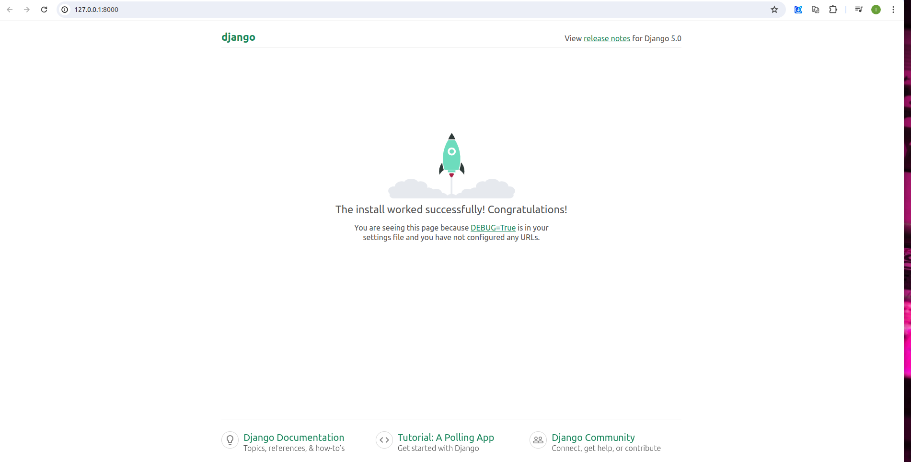

# Django Login, Logout, Signup, Password Change, and Password Reset

## Table of Contents

- Initial Setup
- Log In Page
- Create A HomePage
- Log Out Button
- Sign Up Page
- Password Change
- Password Reset
- Conclusion

### Initial Setup

The first step is to create a dedicated directory for our code, which we'll place on the Desktop in a folder called `django_auth`.

```console
# Windows
$ cd onedrive\desktop\
$ mkdir django_auth
$ cd django_auth`

# Linux
$ cd ~/OneDrive/Desktop/
$ mkdir django_auth
$ cd django_auth

# macOS
$ cd ~/desktop/
$ mkdir django_auth
$ cd django_auth

```

Next, activate a new virtual environment called `.env`.

```console
# Windows
$ python -m venv .venv
$ .venv\Scripts\Activate.ps1
(.venv) $ python -m pip install django~=5.0

# Linux
$ python -m venv .venv
$ source .venv/bin/activate
(.venv) $ python -m pip install django~=5.0

# macOS
$ python3 -m venv .venv
$ source .venv/bin/activate
(.venv) $ python3 -m pip install django~=5.0

```

Then install Django, create a new Django project called `django_project`, run `migrate` to initialize the new database, and execute `runserver` to start up the local web server provided by Django.

```console
(.env) $ django-admin startproject django_project .
(.env) $ python manage.py migrate
(.env) $ python manage.py runserver
```

Navigating to http://127.0.0.1:8000, you'll see the Django welcome screen.



The Django `contrib` module provides built-in apps to help with development. In the `django_project/settings.py` file under `INSTALLED_APPS`, you can see that `auth`is listed and available to us.

```console

# django_project/settings.py

INSTALLED_APPS = [
    'django.contrib.admin',
    'django.contrib.auth',
    'django.contrib.contenttypes',
    'django.contrib.sessions',
    'django.contrib.messages',
    'django.contrib.staticfiles',
]
```

To use the `auth` app, we need to add it to our project-level `django_project/urls.py` file. At the top, import `include` and create a new URL path at `accounts/`. You can choose a different URL path, but using `accounts/` is a standard practice and requires less customization later.

```console
# django_project/urls.py
from django.contrib import admin
from django.urls import path, include  # new

urlpatterns = [
    path("admin/", admin.site.urls),
    path("accounts/", include("django.contrib.auth.urls")),  # new
]
```

The `auth` app we've now included provides us with multiple [authentication views](https://docs.djangoproject.com/en/5.0/topics/auth/default/#module-django.contrib.auth.views) and URLs for handling login, logout, password change, password reset, etc. It notably does not include a view and URL for signup, so we have to configure that ourselves.

```console
accounts/login/ [name='login']
accounts/logout/ [name='logout']
accounts/password_change/ [name='password_change']
accounts/password_change/done/ [name='password_change_done']
accounts/password_reset/ [name='password_reset']
accounts/password_reset/done/ [name='password_reset_done']
accounts/reset/<uidb64>/<token>/ [name='password_reset_confirm']
accounts/reset/done/ [name='password_reset_complete']
```

### Log In Page

Let's make our login page! By default, Django will look within a templates folder called registration for auth templates. The login template is called `login.html`.

Create a new project-level directory called `templates` and a directory called `registration` within it.

```console
(.env) $ mkdir templates
(.env) $ mkdir templates/registration
```

Then create a `templates/registration/login.html` file with your text editor and include the following code:
